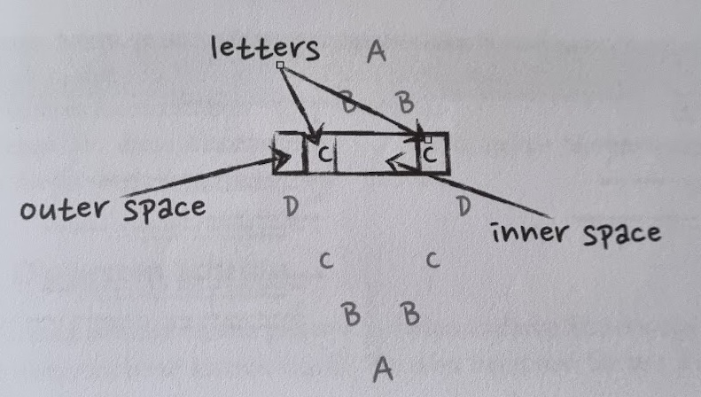

# The Diamond TDD Kata

## Introduction

The Diamond TDD Kata is a coding exercise that focuses on Test-Driven Development (TDD) principles. The goal is to create a program that generates a diamond shape based on a given letter.

For the input letter 'C', the output should be:

```
  A
 B B
C   C
 B B
  A
```

## Start

This project uses Vitest as testing framework.

Run tests
```sh
npm test
```

## Draft

  